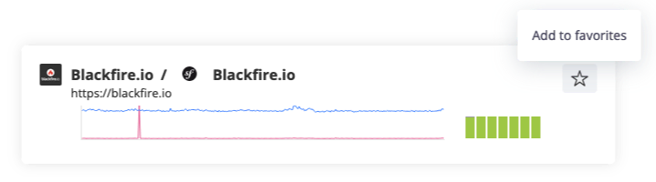

Environments
============

.. include-twig:: `youtube-iframe`
    :title: introduction-to-blackfire
    :src: https://www.youtube-nocookie.com/embed/_lLyz7Xpay8?rel=0&showinfo=0&modestbranding=1&autoplay=0
    :width: 700px
    :height: 394px

What's a Blackfire Environment?
-------------------------------

**It is a collaborative workspace** where to invite collaborators, who are
automatically granted your Edition features and usage level. All profiling
and testing data is shared with the team.

**It is a testing silo** where you write custom metrics according to your
business logic, define tests and their applicability, and where you compare
profiles and iterate.

**It is plugged into your tools and workflow** where you run test scenarios
and gather their reports.

**It lets you manage access to your servers** where you configure at will
the probe, agent, and credentials.

Environments Configuration
--------------------------

Environments configuration include:

 * The ability to add collaborators;
 * The ability to :doc:`run synthetic monitoring </builds-cookbooks/synthetic-monitoring>` with Blackfire Player;
 * The ability to :ref:`configure variables <assertions-variables>`;
 * The ability to :ref:`configure the environment's server credentials <configuration-agent>`
   in any machine where Blackfire is installed;
 * The ability to :doc:`migrate profiles from another environment </profiling-cookbooks/migrating-profiles>`.

.. note::

    Environments are a very flexible way to profile and test the performance of
    your applications, disregarding the physical machines or VMs. More
    specifically:

    * There's no limit on the number of servers: You can configure the probe
      and agent of a unique Blackfire Environment on multiple servers.
    * There's no limit on the number of projects: The same Blackfire Environment
      can be used to gather data from as many projects as you need
    * There's no limit in an environment's endpoint configuration, so that with
      the same environment you can run your test scenarios on different
      domains/sub-domains.

.. _sandbox-environment:

Sandbox Environment
-------------------

Every paying plan includes one dedicated **Sandbox** environment at no extra
cost.

Use it to run deterministic profiles outside of your team workflow:
reproduce an issue in isolation, test an instrumentation change, or hand off a
profiling context to a colleague.

The Sandbox is a first-class environment. It behaves like any other environment,
so you configure it the same way, with the same features.

Migration from the Personal Agent
~~~~~~~~~~~~~~~~~~~~~~~~~~~~~~~~~

The Personal Agent is sunset and the Sandbox environment replaces it.

.. caution::

    The Personal Agent will be removed entirely in December 2026. Move to your
    Sandbox environment before then.

To move to the Sandbox environment:

1. Configure the agent for your Sandbox environment as you would for any other
   environment. The :ref:`blackfire agent:config <configuration-agent>` command
   runs an interactive wizard that collects and validates the credentials for
   you.
2. :doc:`Migrate the profiles </profiling-cookbooks/migrating-profiles>` made
   with the Personal Agent to your Sandbox environment. Batch migration moves
   them in a single operation.

If you run into anything unexpected during the transition,
:route:`contact Support <contact-us>`.

Favorite Environments
----------------------

You can quickly access your most-used environments by marking them as favorites.
Favorite environments are listed first within your organizations and your
`environments page <https://app.blackfire.io/my/environments>`_.

To add or remove an environment from your list of favorites, click the
star icon on the top right of its tile:

Environment Admin Role
----------------------

The Environment Admin can change the configuration of an Environment. The
Environment Owner can promote an Environment Member to the Admin role or
demote them.

More specifically, the Environment Admin can:

    * Change the environment settings
    * Invite and revoke Environment Members
    * Change the Builds settings (Notifications Channels, Variables, Tested URLs)

And they cannot:

    * Revoke the Environment Owner
    * Promote an Environment Member to Environment Admin
    * Delete the Environment

Example Use Case: Monitoring Production
---------------------------------------

.. include-twig:: `youtube-iframe`
    :title: monitoring-production
    :src: https://www.youtube-nocookie.com/embed/px_kVnbzNk8?rel=0&showinfo=0&modestbranding=1&autoplay=0
    :width: 560px
    :height: 315px
