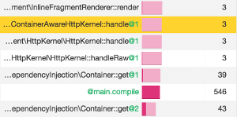

FAQ
===

.. _blackfire-stack:

The Blackfire Stack
-------------------

The Blackfire Stack is made of **five main components**:

* the **Probe** is a language extension that gathers the raw observability data;

* the **Agent** is a server-side daemon that receives raw observability data
  from the Probe, and forwards them to Blackfire server;

* the **Browser Extension** is a web browser extension used mainly to trigger
  profiling from a browser;

* the **Client** is the command line equivalent of the browser extension, it can
  be used from anywhere;

* the **Website** is used to visualize the profiles.

The following schema describes the general workflow of Blackfire and the
communications established between each of its components.

.. image:: /images/general-workflow.png

..
    FIXME: To be uncommented when we have some shared agents!

    .. _blackfire-public-shared-agent:

    What are the Limitations of using the Public Shared Agent?
    ----------------------------------------------------------

    Using our public shared agent is a great way to get started faster when
    installing Blackfire on your local machine as you have one less package to
    install and configure.

    Be aware of the following limitations:

    * Profiles are sent on the wire without being sanitized;
    * Profiles are not pruned and can result in big payload being submitted;
    * It is not available for servers and paid plans.

.. _blackfire-data-privacy:

What Data Is Sent to the Blackfire Servers?
-------------------------------------------

At Blackfire, we take the security and confidentiality topic very seriously, to
ensure the best experience possible while avoiding collecting unnecessary data,
and provide safe authentication and hosting methods.

In a blink, here's what we do, and do not do:

* Confidentiality/Privacy when profiling:

  * We do not collect user session data;
  * We do not collect data from any database;
  * We do not collect any source code;
  * We do collect method/function/class names as caller/callee pairs, file
    names, and resources consumption metrics;
  * We anonymize SQL queries and HTTP calls (arguments, usernames, passwords,
    ...) before data is sent to our servers (except when explicitly told
    otherwise via the debug addon).

* Security

  * SSL Encryption transport layer;
  * Amazon data center;
  * Thorough Access Control;
  * Agent access secured by `public/private key cryptographic mechanism
    <https://blog.blackfire.io/credentials.html>`_;
  * Your profiles are private (except if you explicitly share them publicly);
  * All your data is erased when you request so.

You can have a clear vision of the data sent to our servers by using a proxy
between the Blackfire Agent and the Blackfire Servers. We released a `PHP script
<https://blog.blackfire.io/data-privacy-and-blackfire.html>`_ that can help you
in doing so.

Is Blackfire GDPR Compliant?
----------------------------

Blackfire `has been audited by an expert third party
<https://blog.blackfire.io/gdpr-compliance.html>`_ and **is fully GDPR
compliant**.

Can you please send a Data Processing Addendum?
-----------------------------------------------

Blackfire :ref:`is not collecting any end user data <blackfire-data-privacy>`.

A Data Processing Addendum may be required to be signed between two parties, a
Controller and a Processor. A Controller collects personal information from its
users. A Processor can get some of that data from the Controller, and process it,
as the value it provides to the Controller.

**Blackfire is not a Processor of any data you collect from your users. There is
therefore no need for you to have a Data Processing Addendum with Blackfire.**

How Should I Configure my Firewall to let Blackfire Access my Apps?
-------------------------------------------------------------------

When configuring Blackfire to run performance test scenarios on your application,
the Blackfire servers need access to your application's servers.
If the profiled application is behind a firewall, let the Blackfire servers
access the application by allowing IPs ``46.51.168.2`` and ``54.75.240.245`` in
your configuration for the web ports (usually ``80`` and ``443``).

What Do Function Suffixes like ``@1`` Mean?
-------------------------------------------

Suffixes like ``@1`` are appended when functions or methods are invoked
recursively - which means they call themselves. The number following the ``@``
represents the level of nesting.

Is there any profile request limit?
-----------------------------------

For regular usages, you should never hit 1,000 profiles per day per user.

Is there any builds request limit?
-----------------------------------

For regular usages, you should never hit 350 builds per day per user.

.. _go-support:

Does Blackfire support Go?
--------------------------

:doc:`Blackfire Continuous Profiler </continuous-profiling-cookbooks/index>`
supports Go, Node.js, PHP, and Python.
