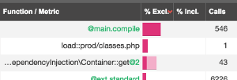

Time
====

Time is probably the most interesting dimension you need to look at when trying
to optimize the performance of an application. But time comes in several
flavors.

All times displayed in the Blackfire interface can be more accurately referred
to as **wall-clock times** or just **wall times**.

The wall time for a function call (represented as a node in the interface) is
the measure of the **real time** it took to execute the code, the difference
between the time at which the function was entered and the time at which the
function was left.

Blackfire gives you two wall times:

* The **inclusive time**, when the time includes the wall time for the function
  call **including** the inclusive time for all its children (the **inclusive
  wall-time**);

* The **exclusive time** is the time spent in the function itself,
  **excluding** time spent in children.

The wall time is made of two parts:

* The **CPU time** is the amount of time for which the CPU was **used** for
  processing instructions;

* The **I/O time** is the time the CPU **waited** for input/output (I/O)
  operations (network, disk, ...)

*How can you interpret those times?*

The **inclusive time** allows you to determine the critical path of your
application.

The **exclusive time** tells you which nodes consumed the most time by
themselves; those are probably the ones you might want to optimize first.

The **I/O time** is a great way to spot nodes where some intensive I/O
activities took place: some code waited for the network (database calls, Redis
calls, HTTP calls, ...) or the disks (file inclusions, ...). Keep in mind
that the I/O is rarely 0 as it also includes non-significant activities
like memory access.

Inclusive versus Exclusive Costs?
---------------------------------

In a profile, the code execution is represented as a graph of nodes; so each
node can have parents and children. The **exclusive cost** is the amount of
resources consumed by the node itself, without the costs of its children. The
**inclusive cost** is the sum of the resources consumed by the node itself plus
the costs of all its children (including the children of the children and so
on).
