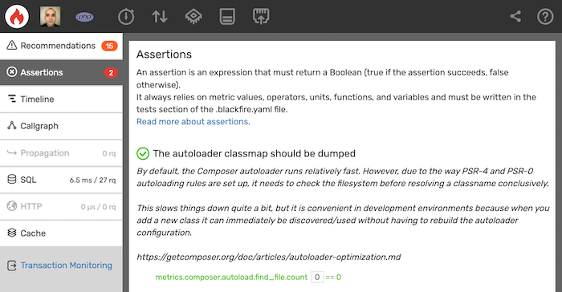
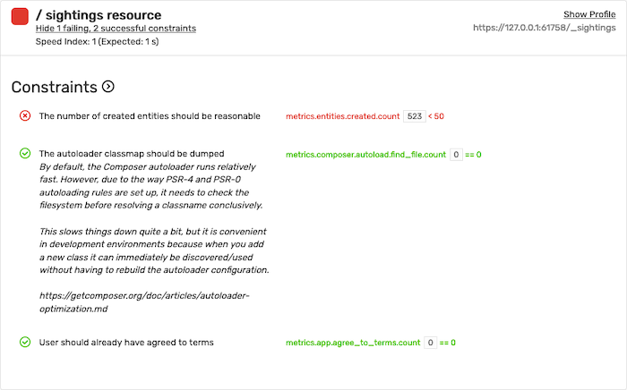

Assertions
==========

An assertion is **an expression that must return a Boolean** (``true`` if the
assertion succeeds, ``false`` otherwise).

It always relies on **metric values**, **operators**, **units**,
**functions**, and **variables** and must be written in the :doc:`tests
section of the .blackfire.yaml file </testing-cookbooks/tests>`:

.. code-block:: yaml

    tests:
        'All pages are fast':
            path: '/.*'
            assertions:
                - 'main.wall_time < 50ms'
                - 'main.peak_memory < 10mb'
                - 'main.network_out < 10kb'

        'Not too many SQL queries on the homepage':
            path: '/(en|fr)/blog/'
            assertions:
                - 'metrics.sql.queries.count < 5'

In the above example, ``main.network_out``, ``metrics.sql.queries.count``, and
``main.peak_memory`` are metric values. A unit like in ``10mb`` :ref:`can be set
explicitly to override default units <units>`.

.. note::

    Whenever possible, **we recommend you write assertions that do not
    depend on time**. The main reason is that :doc:`time is always a consequence
    </php/training-resources/book/12-tests-best-practices>`, a symptom of a deeper issue.

Comparison Assertions
---------------------

Assertions support :ref:`profile comparison <assertions-comparisons>` as well
to assert the performance evolution of your code:

.. code-block:: yaml

    tests:
        "Pages should not become slower":
            path: "/.*"
            assertions:
                - "percent(main.wall_time) < 10%"       # time does not increase by more than 10%
                - "diff(metrics.sql.queries.count) < 2" # less than 2 additional SQL statements

.. note::

    Comparison assertions are only evaluated :doc:`when running builds
    </builds-cookbooks/index>`.

    Values are **compared between the current build and a reference build**.
    The reference can be either :ref:`the last successful periodic build
    <build-periodic-scenarios>` or :ref:`a build that has been referenced in
    the webhook command <builds-comparison-webhook>` with
    ``--external_parent_id`` option.

Metric Values
-------------

Blackfire exposes :doc:`metrics <metrics>` that are associated with the current
profile. **The value of one dimension of a metric** can be used in assertions;
for instance, the ``count`` value of the ``sql.queries`` metric is stored in
``metrics.sql.queries.count``.

Learn more about all :ref:`built-in metrics <metrics-built-in-metrics>` exposed
in assertions by default and :ref:`how to create your own
<metrics-custom-metrics>`.

The available dimensions for metrics are the following ones:

.. include-twig:: `dimensions`

.. _units:

Units
-----

For each metric (count, time, or memory), a default unit is defined:

* The default **time unit** is the millisecond;
* The default **memory unit** is the byte.

When using ``10`` in an assertion for a time value, that evaluates to 10
milliseconds. It is possible to add an explicit unit to a metric, which will
override the default unit.

The following time units are supported: ``ms``, ``s``.

The following memory units are supported: ``kb``, ``kib``, ``mb``, ``mib``,
``gb``, ``gib``.

The following generic units are supported: ``k``, ``ki``, ``m``,
``mi``, ``g``, ``gi``.

Operators
---------

The following operators are supported in assertions:

Comparison
~~~~~~~~~~

* ``==`` equals;
* ``!=`` not equals;
* ``<`` less than;
* ``>`` greater than;
* ``<=`` less than or equal to;
* ``>=`` greater than or equal to.

Logic
~~~~~

* ``not`` or ``!``;
* ``and`` or ``&&``;
* ``or`` or ``||``.

Math
~~~~

* ``+`` addition;
* ``-`` subtraction;
* ``*`` multiplication;
* ``/`` division;
* ``%`` modulus;
* ``**`` pow.

.. _assertions-variables:

Variables
---------

Variables are useful when you configure several Blackfire :doc:`environments
</reference-guide/environments>` to run performance tests on various machines
hosting the same application. Variables make it possible to use the same
``.blackfire.yaml`` configuration on several servers that
have different purposes (e.g. development, staging, production).

Variables can be defined in the environment configuration and used in an
expression by passing the metric key to the ``var()`` function.
Variable values may also use :ref:`units <units>`.

**Example:** You have configured two different environments in Blackfire:

* ``Integration`` hits your integration server, where your application runs
  with debug mode on;

* ``Production`` hits your production servers, where your application runs with
  debug mode off.

The same application runs on all servers, but the debug mode increases memory
usage a lot. As such, you cannot set the same maximum value for your
assertions on memory.

Your ``.blackfire.yaml`` would look like this when using variables:

.. code-block:: yaml

    tests:
        "Pages shouldn't use too much memory":
            path: "/.*"
            assertions:
                - "main.peak_memory < 10mb * var('memory_coeff')"

Now in both your ``Integration`` and ``Production`` Blackfire environments,
you have to create the ``memory_coeff`` variable:

* For ``Integration``, ``memory_coeff == 2``
* For ``Production``, ``memory_coeff == 1``

The ``var()`` function may also receive a **default value as a second
argument**.
This default value is used whenever the variable is not defined in one of your
environments.

.. code-block:: yaml

    tests:
        "Pages shouldn't use too much memory":
            path: "/.*"
            assertions:
                - "main.peak_memory < 10mb * var('memory_coeff', 1)"

.. caution::

    The ``vars.xxx`` notation, supported in older versions of Blackfire, is now
    deprecated. We strongly advise you to migrate your expression to use
    the ``var()`` function instead.

.. _assertion-description:

Assertions' Description
-----------------------

An optional description can be added to an assertion. This could provide a
context or an educational note left for the other developers of your team.

This note can help understand the
performance challenges of some parts of the application.

.. code-block:: yaml
    :emphasize-lines: 6-17

    tests:
        "The autoloader classmap should be dumped":
            path: "/.*"
            assertions:
                - "metrics.composer.autoload.find_file.count == 0"
            description: |
                By default, the Composer autoloader runs relatively fast. However,
                due to the way PSR-4 and PSR-0 autoloading rules are set up, it
                needs to check the filesystem before resolving a classname
                conclusively.

                This slows things down quite a bit, but it is convenient in
                development environments because when you add a new class it can
                immediately be discovered/used without having to rebuild the
                autoloader configuration.

                https://getcomposer.org/doc/articles/autoloader-optimization.md

The description is displayed on the *Assertions* tab of a Profile:

And within *Build* reports:

Development vs Production
-------------------------

When an assertion is run from an environment, the ``is_dev()`` function returns
``false`` when the environment is configured for production usage.

.. _assertions-comparisons:

Builds Comparison
-----------------

When :doc:`using builds </builds-cookbooks/index>`, it is possible
to compare one build to another. This is useful when you want to validate a
code merge (e.g. a pull-request) by :ref:`triggering a build webhook
<builds-comparison-webhook>` or a :ref:`Blackfire Player collection of scenarios
<builds-comparison-player>`. It can also ensure that your code doesn't
have performance regression over time :ref:`using periodic builds
<builds-comparison-periodic>`.

Comparison can be made within assertion expressions thanks to the ``percent()``
and ``diff()`` functions:

If you want to assert that a metric value does not increase by more than a
given percentage between two builds, use the ``percent()`` function:

.. code-block:: text

    "percent(main.wall_time) < 10%"

You can also test the evolution of a metric value in absolute terms with the
``diff()`` function:

.. code-block:: text

    "diff(metrics.sql.queries.count) < 2"

In this example, the assertion checks that the profile from the newer build has
less than 2 additional SQL statements compared to the previous one.
