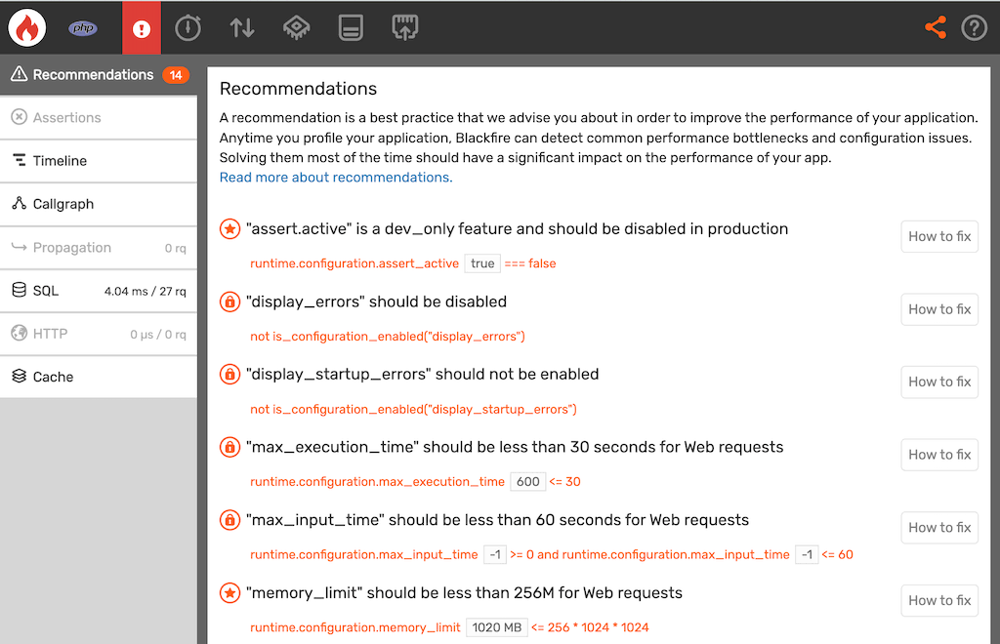

Recommendations
===============

What is a recommendation
------------------------

A **recommendation** is a best practice that we advise you about in order to
improve the performance of your application. Anytime you profile your
application Blackfire can detect common performance bottlenecks and
configuration issues. Solving them most of the time should have a significant
impact on the performance of your app.

Technically, a recommendation is a built-in :doc:`performance test </testing-cookbooks/tests>`,
that shows up only when relevant. It depends for instance on the detected
framework and whether you are in a development environment or not.

Recommendations are displayed in a dedicated tab on a profile view and in build
reports (they do not impact the test results in terms of fail/pass). Any
recommendation can be directly copied as a test that you'll paste in your
`.blackfire.yaml` file. By clicking on the `How to fix` button near to it, you
will be able to read more about the recommendation, and how to write the
corresponding test.

Recommendations depend on your environment's configuration. A development
environment's recommendations will differ from non-development environments,
for instance with regards to caching strategies. Moreover, Blackfire offers you
only recommendations that are relevant to your project type (Symfony, Laravel,
Magento, Drupal, Ibexa,...).

For any feedback and ideas on recommendations, don't hesitate to
:route:`Contact us <contact-us>`.

Performance, Quality, and Security
----------------------------------

Most recommendations aim at improving the performance of your code.

But Blackfire can detect a lot more than performance bottlenecks at runtime. A
:doc:`Blackfire test </testing-cookbooks/tests>` can be used to spot any
unexpected or unwanted code behavior. That is also true for security and quality
best practices.

.. note::

    Quality and Security recommendations are options for paid subscriptions.
    Performance recommendations are included in Development and Production Editions.

In the following example, we profiled Finding Bigfoot, the application on which
we demo all of Blackfire's features in :doc:`Blackfire's book </php/training-resources/book/index>`.

Supported frameworks
--------------------

* PHP: Symfony, Laravel, Magento, Drupal, TYPO3, Prestashop, and Ibexa DXP
* Python: Django

Want to contribute and add more recommendations, on a supported framework or a
new one? :route:`Contact us <contact-us>`.

Adding a recommendation to your tests
-------------------------------------

Whenever you start writing :doc:`your tests </testing-cookbooks/tests>`, build
statuses in Blackfire will only be conditioned by it. If your tests are green, and
that one or more recommendations show up, the build status will still be green.

You can make sure that the recommendation is part of your tests by copy-pasting
the yml code at the bottom of the recommendation documentation.

This also provides a way to adjust recommendations to your context and code base.

Disabling a Recommendation
--------------------------

Recommendations may sometimes be false positives. In some cases, you might want
to fully discard it.

To do so, add a ``recommendations:`` section to your ``.blackfire.yaml`` file, and list
any recommendations that you would like to disable. You will find recommendation
IDs, such as ``php.too_many_sql`` at the bottom of the recommendation
documentation.

.. code-block:: yaml

    # Configure recommendations.
    recommendations:
        # Disable the 'You should execute less SQL queries' recommendation for a PHP app
        php.too_many_sql:
            enabled: false
