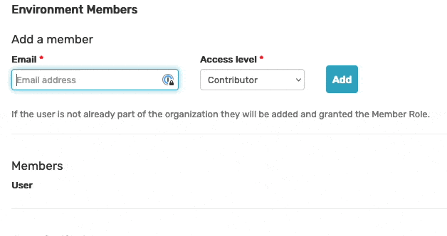
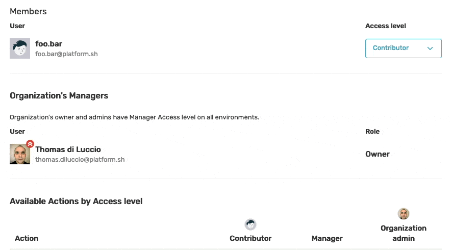
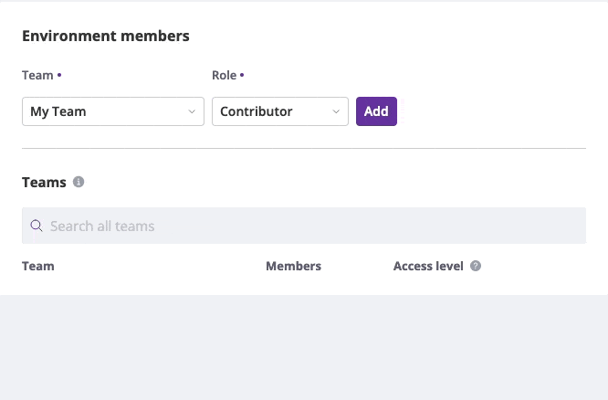

Environment Access Levels
=========================

Two levels are available at the Environment level: **Contributor** and
**Manager**:

- **Contributor**: Can use Monitoring and generate Profiles on the environment. 
  Can view other Members Access Levels and Usage Data for the environment.

- **Manager**: Same as Contributor plus ability to configure the environment, 
  invite Members and configure their access levels.

The **Organization admins** (**Admin** and **Owner**) can perform all possible
actions including deleting the ``Environment``.

New Environment members can be invited through a form:

The Environment Access Management page lists all the Users assigned to the
Environment and allows Users with Manager access level to update access levels
or even remove access to the environment for any Member by selecting *No Access*.

Access levels can also be defined for a whole :doc:`Team <teams>` from the
`Teams` tab.

