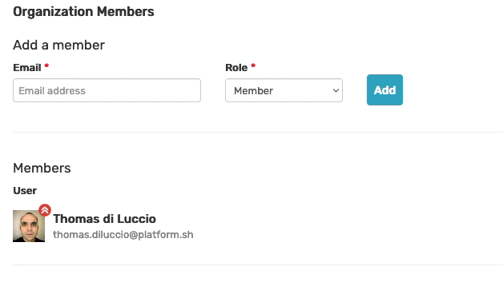
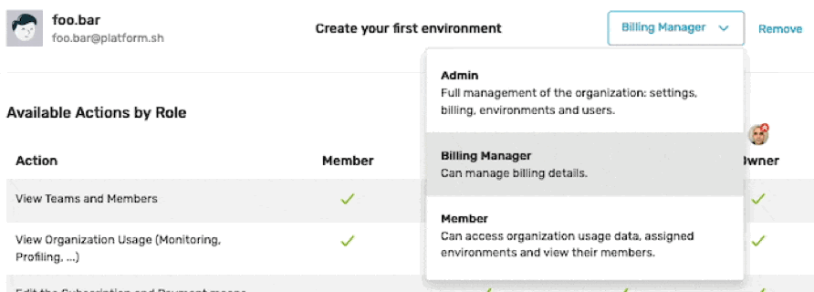

Organization Roles
==================

Four roles are available at the Organization level: **Member**,
**Billing Manager**, **Admin** and **Owner**:

- **Member**: Can access organization usage data, assigned environments
  and view other members of assigned environments.

- **Billing Manager**: same as **Member**. Can also manage billing
  and subscription details, and access invoices;

- **Admin**: Full management of the organization: settings, billing,
  environments and users. The **Admin** role can be seen as the delegation by
  the **Owner** to administrate the Organization. **Admins** cannot delete the
  Organization;

- **Owner**: The **Owner** can perform all possible actions. Only the **Owner**
  can delete the Organization. That role cannot be shared but can be transferred
  by reaching out to `Blackfire support <https://support.blackfire.platform.sh>`_.

The **Organization admins** (**Admin** and **Owner**) get automatically the
highest possible level of permissions on all the Environments of the
Organization.

New Organization members can be added through a form:

The Organization Access Management page lists all the Users of the Organization
a user can see based on the ``Environment`` they have access to.

It allows permitted users (**Admin** and **Owner**) to add and remove Members
and manage their access level for each environment.

The Owner and each Admin count towards the paying users quota of the
organization.

Members and Billing Managers are counted in the user quota only when they are
assigned to at least one environment.
