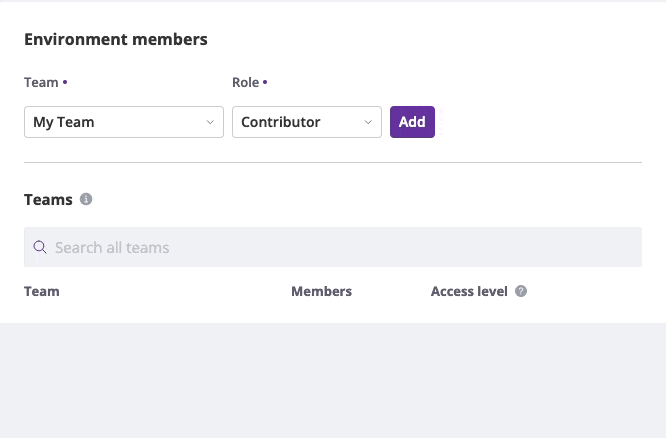

Teams Management
================

A Team is a group of users that can be given access to one or more
environments as a whole.

Each member of a team inherits the access level from that team for an
environment.

The final access level of a member in an environment is the highest of all the
teams they are member of, that are assigned to that environment. A higher
individual access level can also given to upgrade the level of access provided
by one or several teams.

Create a Team
-------------

Teams can be created from the :doc:`Organization Access Management <organization-roles>`
page.

Members can be added to a Team by adding their email addresses.

The `Environment Access` tab allows to define the level of access the team has
for each Environment.

At the Environment level, the :doc:`Environment Access Management <environment-levels>`
also permits to define the Access Level of a Team.

Delete a team
-------------

A Team can be deleted by editing its details. Deleting a team also deletes
the access that team provides.

