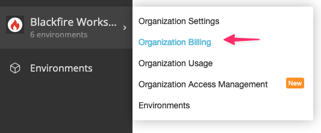

Managing your subscription
==========================

.. include-twig:: `youtube-iframe`
    :title: introduction-to-blackfire
    :src: https://www.youtube-nocookie.com/embed/okaCm_8fWKU?rel=0&showinfo=0&modestbranding=1&autoplay=0
    :width: 700px
    :height: 394px

Organization Admins and Billing Managers can manage their self-service
:term:`Organization <Organization>` subscription from the organization billing
settings page in your dashboard.

.. note::

    Users who subscribed through Platform.sh can find their
    invoices in their console and manage their subscription via their sales
    representatives.

The organization billing settings page allows you to:

- upgrade, downgrade or cancel your subscription
- update or top up your monthly :doc:`monitoring </monitoring-cookbooks/index>`
  quota
- update or top up your monthly :doc:`browser monitoring </front-end-observability/index>`
  quota
- subscribe to the :doc:`debug </profiling-cookbooks/debugging>` and `magento
  <https://www.blackfire.io/magento/>`_ add-ons
- update your billing information
- update your payment method (credit card or SEPA)
- access all your past invoices

This settings page informs you on the numbers of paying users and environments
you currently have.

Detailed information is available on the :doc:`Monitoring
Usage <../monitoring-cookbooks/monitoring-usage>` and :doc:`Profiling Usage
<../profiling-cookbooks/profiling-usage>` pages.

.. note::

    :doc:`Billing Managers <access-management/organization-roles>` can manage
    the Organization's billing and access invoices.

    Billing Managers don't have access to observability data and therefore don't
    count as active users when it comes to licensing fees.
